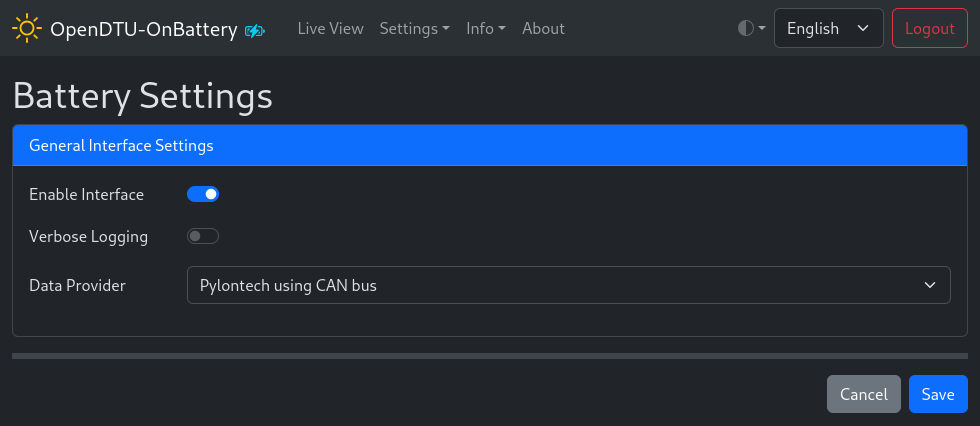

# Battery Settings

## Screenshot

## Settings / Parameters

### General Interface Settings

#### Verbose Logging :material-toggle-switch:{title="Switch"}

Enable to log more information regarding the battery interface on the (serial)
console. The actual verbosity and type of messages vary among the different
data providers.

#### Data Provider :material-form-dropdown:{title="Dropdown"}

Select the data provider applicable to your setup. The settings for each
battery data provider are different.

### Provider Settings

There are no additional settings for the Pylontech, Pytes, and Victron
SmartShunt interfaces. Refer to the respective subpage for more information
about the [MQTT](battery_settings_mqtt.md) or [JK
BMS](battery_settings_jkbms.md) provider settings.
