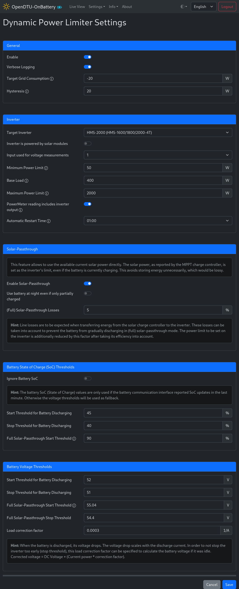

# Dynamic Power Limiter (DPL)

## Screenshot

## Settings/Parameters

!!!warning "Dynamic UI"
    Some settings may not be visiable/accessible, depending on your setup of
    other features, e.g., without a battery interface enabled, SoC thresholds
    cannot be configured.

### General

#### Enable :material-toggle-switch:{title="Switch"}

Enables or disables the DPL.

!!!note "Disabling"
    When disabling the DPL using this switch, the inverter previously managed
    by the DPL (if any) is shut down. Once it was shut down, the DPL does not
    send any more commands to that inverter.

#### Verbose Logging :material-toggle-switch:{title="Switch"}

Enable to log more information regarding the calculation of the power limit to
the (serial or web) console. Definitely enable this and read the logs if the
DPL does not behave as expected, and share the output in case you seek help.

#### Target Grid Consumption :material-form-textbox:{title="Textbox"}

The DPL calculates an inverter limit such that the power meter reads this
amount of power. To implement a zero export policy, set this value to zero. If this
value is negative, the power limit will be calculated such that the configured
power is fed into the grid.

!!!warning "Over- and Undershooting"
    The inverter **will** over- and undershoot, especially when significant
    loads (water heaters, electric stoves, etc.) are switch on or off. In
    particular this means that energy will be fed into the grid for some time
    (how long depends on the setup) when loads are switched off.

#### Hysteresis :material-form-textbox:{title="Textbox"}

No limit update will be sent to the inverter if the difference between the
calculated new limit and the current limit, as reported by the inverter, is
less or equal to this hysteresis value.

### Inverter

#### Target Inverter :material-form-dropdown:{title="Dropdown"}

Select the inverter to be controlled by the DPL. In the following, this
inverter is refered to as the "DPL inverter".

#### Inverter Is Powered By Solar Modules :material-toggle-switch:{title="Switch"}

Enable if the DPL inverter is powered by solar panels rather than a battery.
Switches and settings obsolete for these setups are hidden when this switch is
enabled.

#### Compensate For Shading :material-toggle-switch:{title="Switch"}

!!!note "For solar-powered inverters only"
    This option is only available for solar-powered inverters and is not
    included in the screenshot above.

!!!danger "Cabling limits"
    Do **NOT** enable this option if the AC cabling is potentially unable to
    safely handle the **rated** inverter output. The rated output is the
    inverter's AC power output while its limit is at 100% and all inputs
    deliver such that the inverter does output 100% of its rating, e.g., 2000W
    for an HMS-2000. The inverter output can surge over the **configured**
    maximum power limit if any input is no longer saturated at the expected
    power level, e.g., if the shading of a solar module is removed.

The calculated limit is usually sent to the inverter verbatim, and the inverter
will output the amount of power equivalent to the calculated limit, as it is
indeed able to draw the needed power from the battery. All inputs draw the same
amount of current.

Enable this option to scale the calculated limit such that the solar-powered
inverter is expected to output the calculated limit, despite significantly
different power being available on the inputs. This usually happens due to
shading of a subset of solar modules. This scaling means that the limit sent to
the inverter is actually higher than the calculated limit, but because some
inputs are saturated, the effective power output is equal to the calculated
limit.

#### Input Used For Voltage Measurement :material-form-textbox:{title="Textbox"}

The battery voltage is read from the DPL inverter's input with this index if no
other source is available to read the battery voltage.

#### Minimum Power Limit :material-form-textbox:{title="Textbox"}

In case the calculated limit for the inverter is smaller than this value, the
inverter is actually

* shut down if the inverter is battery-powered.
* set to this minimum power limit if the inverter is solar-powered.

!!!note "Stable operation"
    Small power limits (can) lead to oscillating power output and the inverter
    shutting down because of these oscillations. As a rule of thumb, the
    minimum limit should be greater or equal to the amount of inverter inputs
    times 12W.

#### Base Load :material-form-textbox:{title="Textbox"}

In case the power meter reading is unavailable (transient error) or in setups
without a power meter configured, this value is assumed as the power meter
reading. Choose this value such that it is close to but slightly smaller than
your household's base load, i.e., the amount of power that is expected to be
consumed in any case.

#### Maximum Power Limit :material-form-textbox:{title="Textbox"}

The inverter limit is set such that its AC output does not exceed this value.

#### Power Meter Reading Includes Inverter Output :material-toggle-switch:{title="Switch"}

Enable this option if the power meter reading is reduced by the inverter's
output when the inverter produces AC power. This is typically true, as the
metering happens between the grid and the inverter.

#### Automatic Restart Time :material-form-dropdown:{title="Dropdown"}

!!!danger "Persistent Limit"
    Manually set a low **persistent** limit when using this feature.

The daily yield of the inverter is usually reset at night when the inverter
turns off due to lack of light. To reset the daily yield even though the
inverter is continuously powered by the battery, the inverter can be
automatically restarted at the desired time.

After the inverter restarts, it starts producing power. How much power that is
depends on the value set as the persistent limit. Hence the persistent limit
for inverters managed by the DPL shall be very low if they are automatically
restarted. Otherwise, a possibly empty battery is drained with possibly high
power for some time. The DPL will eventually set a new limit or put the
inverter into standby after it restarted.

### Solar-Passthrough

#### Enable Solar-Passthrough :material-toggle-switch:{title="Switch"}

Enables or disables the [(Full) Solar-Passthrough](../solar_passthrough.md)
feature.

#### Use Battery At Night Even If Only Partially Charged :material-toggle-switch:{title="Switch"}

The inverter may only draw power from the battery during a discharge cycle. For
a discharge cycle to start, the respective start threshold must be reached
first. When enabling this option, a discharge cycle also starts roughly on
sunset, even if the battery charge cycle did not complete.

#### (Full) Solar-Passthrough Losses :material-form-textbox:{title="Textbox"}

Line losses are to be expected when transferring energy from the solar charge
controller to the inverter. These losses can be taken into account to prevent
the battery from gradually discharging in (full) solar-passthrough mode. The
power limit to be set on the inverter is additionally reduced by this factor
after taking its efficiency into account.

### Battery Thresholds

In general, State of Charge (SoC) thresholds take priority over voltage
thresholds, i.e., if the battery SoC is known (battery interface enabled, SoC
value valid and not outdated) it is used to determine whether or not a
particular threshold is reached.

#### Ignore Battery SoC :material-toggle-switch:{title="Switch"}

Enable this switch to have the DPL use the voltage thresholds rather than the
SoC thresholds even though the battery SoC is available. As the SoC value is
hard to keep accurate, it is often a good option to start and stop discharging
based on the battery's voltage rather than the reported SoC.

#### Start Threshold for Battery Discharing :material-form-textbox:{title="Textbox"}

!!!note
    This threshold is "reached" if the battery SoC or voltage value is greater
    or equal to this threshold value.

Drawing power from the battery is allowed once the battery reaches this
threshold. Reaching this threshold starts a discharge cycle.

There is no need for this value to be close to the voltage the battery has when
it is fully charged. Starting to use a partially charged battery, e.g., during
the day while the battery is still being charged, is okay as well.

#### Stop Threshold for Battery Discharing :material-form-textbox:{title="Textbox"}

!!!note
    This threshold is "reached" if the battery SoC or voltage value is smaller
    than this threshold value.

!!!warning "Avoid BMS intervention"
    When using the voltage stop threshold, it should be chosen such that the
    BMS has no need to interfere, i.e., such that the inverter stops
    discharging the battery long before the BMS disables dicharging the battery
    to protect it due to an undervoltage condition.

Battery discharging is avoided once the battery reached this threshold.
Reaching this threshold starts a charge cycle.

This value must be smaller than the battery discharging start threshold.

#### Full Solar-Passthrough Start Threshold :material-form-textbox:{title="Textbox"}

!!!note
    This threshold is "reached" if the battery SoC or voltage value is greater
    or equal to this threshold value.

See [Full Solar-Passthrough documentation](../solar_passthrough.md).

Set to 0% (SoC threshold) and 66V (voltage threshold) to effectively disable
**Full** Solar-Passthrough while keeping Solar-Passthrough. Otherwise this is
typically set to a value that indicates a (nearly) fully charged battery.

#### Full Solar-Passthrough Stop Threshold :material-form-textbox:{title="Textbox"}

!!!note
    This threshold is "reached" if the battery voltage value is smaller
    than this threshold value.

See [Full Solar-Passthrough documentation](../solar_passthrough.md).

When starting Full Solar-Passthrough, the battery stops charging as all solar
power is used by the inverter to produce AC power. This causes the battery
voltage to drop (slightly). Due to fluctuations in the solar power output, the
battery might be slightly discharged in Full Solar-Passthrough mode, causing
the battery voltage to drop further. For that reason, this threshold shall be
configured to a slightly smaller value than the Full Solar-Passthrough start
threshold, such that Full Solar-Passthrough is not started and stopped
repeatedly.

#### Load correction factor :material-form-textbox:{title="Textbox"}

!!!note "Applicable to voltage thresholds"
    This settings is only applicable if the DPL is using voltage thresholds.

When the battery is discharged, its voltage drops. Additionally, depending on
where the battery voltage is read, line losses can significantly influence the
voltage reading, especially at high currents. In both cases, the voltage drop
scales with the discharge current.

In order to not stop the inverter too early (stop threshold) while the battery
is being discharged, this load correction factor can be specified to calculate
(estimate) the battery voltage if it became idle. In other words: This value
should be choosen such that the battery settles back to around the stop
threshold voltage in the moment the DPL decides to stop discharging the battery
because it hit the stop threshold.

`corrected (idle) voltage = measured battery voltage + (power * correction factor)`

This value depends on your setup and requires tuning. Assuming a LFP battery
pack, perform the tuning procedure outside the non-linear voltage range, i.e.,
when the battery is neither full nor empty.

1. Disable all battery loads. This possibly means to disable the DPL.
2. Let the battery settle and note the idle voltage at the point where the DPL
   reads the voltage as well, i.e., the voltage reported by the BMS,
   by the charge controller, or by the inverter input,
   depending on your setup.
3. Enable a high load with a specific power. This typically means to set your
   inverter to the maximum allowable limit (using the web interface).
4. Observe the battery voltage drop and note this voltage (load voltage).
5. Disable the load after a couple of seconds.
6. The battery voltage should settle back (close) to the idle voltage noted
   earlier.
7. `correction factor = (idle voltage - load voltage) / specific power`
