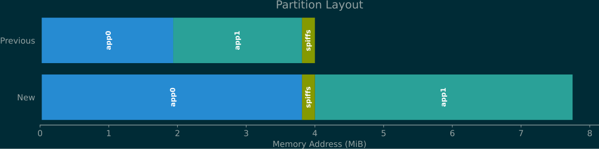

# Upgrade to 2024.08.xx or newer

Upgrading from OpenDTU-OnBattery version 2024.06.03 or older to versions
2024.08.xx or newer requires physical access to the ESP32 board. The new
firmware (factory image including new partition layout) must be written to
flash using the board's USB connection. This is a one-time operation, and newer
versions can again be upgraded over-the-air (OTA), unless you are using an
ESP32 with 4 MB of flash memory. Writing the factory image will preserve the
configuration (do *not* erase the flash beforehand, just write the factory
firmware binary).

## Steps

1. Download one backup of each your `config.json` and `pin_mapping.json`, see
   **Settings** --> **Config Management** in OpenDTU-OnBattery's web
   application to prepare yourself if something should go wrong.
2. Determine the firmware variant (PIO Environment) you are currently using,
   see **Info** --> **System**.
3. Determine the new firmware variant to use for your device, see below.
4. [Flash the factory firmware image](../flash_esp.md) using the USB connection
   of your board.
5. The update should be installed and your device should boot normally using
   the new firmware and using the existing settings.

## New Firmware Variant

Which firmware variant you should use going forward depends on your board (MCU
type and amount of flash memory).

In case you need to first determine how much flash memory is actually available
on your board, install [OpenDTU-OnBattery
2024.06.03](https://github.com/helgeerbe/OpenDTU-OnBattery/releases/tag/2024.06.03)
and navigate to **Info** --> **System** in the web UI. It lists the flash
memory size in section "Hardware Information".

### Coming from `generic` or `generic_esp32`

* Use `generic_esp32_4mb_no_ota` if your ESP32 has only 4 MB of flash memory.
  You will lose the ability to install OTA updates. Install future updates by
  writing a new factory firmware image using the USB connection.
* Use `generic_esp32_8mb` if your ESP32 has at least 8 MB of flash memory.
  Attempting to write this onto a device with 4 MB of flash results in a
  bootloop.

If you are coming from `generic` see the [migration
guide](howto/migrate_generic.md) to configure the wiring to your NRF24 module.
Going forward, there will be no pre-built firmware release with compiled-in
pin mappings, i.e., there is no equivalent variant to `generic`.

### Coming from `generic_esp32s3` or `generic_esp32s3_usb`

The firmware is named the same, but it is now only compatible with devices
having 8 MB or more of flash memory. Attempting to write this onto a device
with 4 MB of flash results in a bootloop.

### Coming from Another Variant

As these variants are custom-build, you should know what you are doing.
Variants for devices with only 4 MB of flash use the partition layout without
OTA support. Other variants use the new layout for 8 MB of flash memory.

## Background

To accomodate a larger firmware binary, the ESP32 flash memory partition layout
changed with the release of OpenDTU-OnBattery version 2024.08.xx. All firmware
released since then uses this new partition layout.

* Partitions `otadata` and `nvs` are not drawn in this graph. They remain
  unchanged.
* The `spiffs` partition was *not* moved in order to preserve the config and
  pin mapping when upgrading.
* Factory firmware images include data up to and including `app0`, i.e., when
  writing these images, the `spiffs` partition is neither erased nor
  overwritten.
* Both older firmware partitions were merged, doubling the space available for
  the first firmware partition `app0`.
* The second firmware partition `app1` starts after the `spiffs` partition and
  has the same size as the first firmware partition `app0`.
* The whole partition layout now spans close to 8 MB of flash memory.
* ESP32 with 4 MB of flash memory using the `generic_esp32_4mb_no_ota` variant
  use the same new layout except that there is no `app1` partition. This is why
  there is no support for OTA updates when using this partition layout. This
  layout does, however, fit 4 MB of flash while also accomodating more space
  (the same amount as for devices with &ge;&nbsp;8 MB) for the firmware.

See [#1025](https://github.com/helgeerbe/OpenDTU-OnBattery/issues/1025) for
more background information.

## Exception for ESP32-S3

For an unknown amount of releases, you may still flash the non-factory firmware
image over-the-air onto an ESP32-S3 board, i.e., without updating the partition
layout. This works as the firmware is slightly smaller for ESP32-S3 as it is
for ESP32. The newer releases still fit the old partition layout for ESP32-S3.
There is no estimate what future release will be too large to fit the old
layout for ESP32-S3. An attempt to write an image that is too large using OTA
will fail gracefully. You will then need to upgrade the partition layout by
flashing the factory image using the USB connection to continue upgrading.
