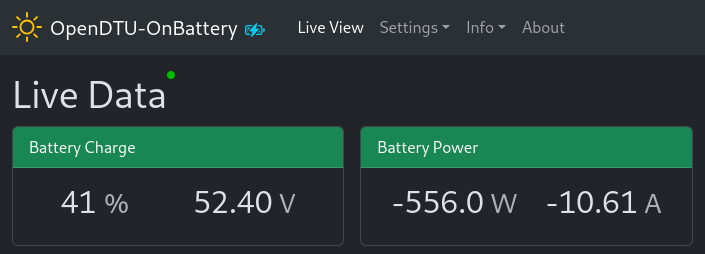

# Overview

Supported battery (management) systems (BMS) can be connected to
OpenDTU-OnBattery. This allows to process battery metrics like its voltage or
state of charge (SoC) by the Dynamic Power Limiter. The collected data is also
published to the MQTT broker and it is presented in the web UI.

The following data providers (battery interfaces) are supported:

1. Pylontech using CAN
2. Pytes using CAN
3. [JK BMS](jkbms/index.md) using UART
4. Victron SmartShunt using VE.Direct
5. MQTT
