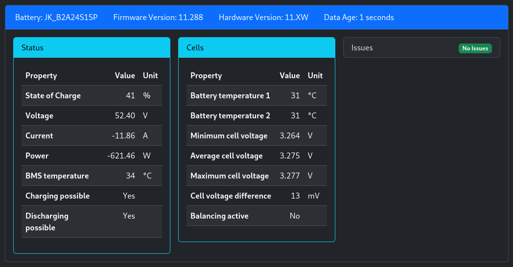

# Introduction

This project supports communication with a JK BMS using a wired medium.
Parameters are polled at customizable intervals and displayed in the Web UI as
well as published to the MQTT broker.

These models are supported:

1. [JK-B* Models](models_b.md)
2. [JK-PB* Models](models_pb.md) (new style Inverter-BMS)

Refer to the [JK BMS battery settings
documentation](../../firmware/configuration/battery_settings_jkbms.md) for
configuration options (all models).
