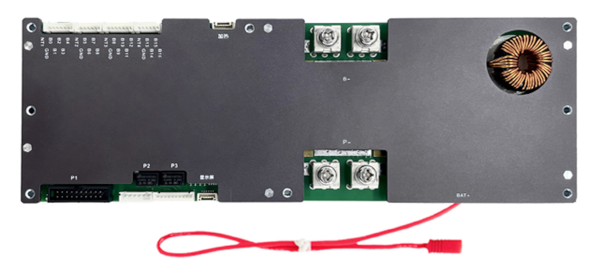

# JK-PB* Models (Inverter-BMS)



The new-style Inverter BMS `JK-PBxAxxSxxP` are also supported (tested hardware
v15 and Firmware v15.10).

Non-exhaustive list of improvements on Inverter BMS compared to older models:

* support for firmware upgrades (Windows utility)
* programmable dry contacts (relay switches)
* voltage settings for 0% and 100% SoC (also available on older models, but
  only if they were shipped with newer firmware (depends on the date of
  purchase))
* **to be explored:** Modbus-compatible RS485 communication, which carries much
  more settings and more info than the existing serial protocol

## Protocol

These models must be configured to use Protocol `000 - 4G-GPS Remote module
Common protocol V4.2` as `UART1 Protocol` using the Bluetooth App or Windows
Software.


## RJ45 Connector


Use the leftmost RJ45 connector, which is pinned as follows:

| Pins | Function |
|------|----------|
| 1, 8 | RS485-B  |
| 2, 7 | RS485-A  |
| 3, 6 | GND      |

## Wiring Options

Two wiring methods are supported. The `battery.rx` and `battery.tx` pins must
be defined in the pin mapping for both methods. When using the `RS-485
Transceiver on MCU` interface type, `battery.rxen` and `battery.txen` pins must
also be defined. See the [device profile
documentation](../../firmware/device_profiles.md) for more details.

### RS485 with external Transceiver and UART-TTL

The wiring can be completed using an external RS485 to UART-TTL converter
board. Search for `DEBO TTL-RS485` on
[reichelt.de](https://www.reichelt.de/entwicklerboard-uart-ttl-zu-rs485-converter-debo-ttl-rs485-p316262.html)
for an example. For the UART receive pin on the ESP32 an input-only pin may be
used.

```
           RS485           RS485-TTL
┌────────┐       ┌────────┐         ┌───────┐
│        │<A---A>│        │<TX---RX>│       │
│ JK-BMS │<B---B>│ RS485  │<RX---TX>│ ESP32 │
│        │<-GND->│ to 3V3 │<--GND-->│       │
│        │       │        │<--3V3-->│       │
└────────┘       └────────┘         └───────┘
```

Use the `TTL-UART on MCU` interface type in the OpenDTU-OnBattery settings for
this setup. The ESP32 will talk UART to the converter board. The RS485
transceiver is transparent to the ESP32. That also means it has no explicit
control over the transmitter or receiver. That in turn might cause the ESP32 to
read its own data (only for bad converter boards).

### RS485 with Transceiver

The wiring can be completed using only an RS485 transceiver chip that is
connected to the ESP32 directly. This is the case for the [OpenDTU Fusion
board](../../3rd_party/opendtu_fusion.md), where an ISL3178E transceiver is in
use. There are also breakout-boards available that only have a RS485
transceiver (search for `MAX485 Module`).

This setup requires four pins on the ESP32: Two for data (one input, one
output), one that controls the receiver, and another that controls the
transmitter. The latter two are outputs.

```
            RS485
              ┌──────────────────────────────┐
┌────────┐    │    ┌───────────┐   ┌───────┐ │
│        │<A--+--A>│A      RXEN│<->│15     │ │
│ JK-BMS │<B--+--B>│B        RX│<->│16 ESP │ │
│        │    │    │       TXEN│<->│46  32 │ │
│        │<-->│GND │ISL3178E EN│<->│45     │ │
└────────┘    │    └───────────┘   └───────┘ │
              │       OpenDTU Fusion v2      │
              └──────────────────────────────┘
```

Use the `RS485-Transceiver on MCU` interface type in the OpenDTU-OnBattery
settings for this setup.
