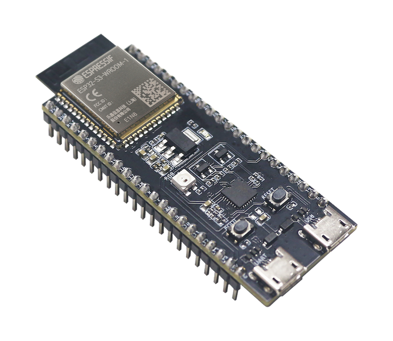

# Selecting a Board

## TL;DR

If you insist on wiring up the hardware yourself instead of using an
[integrated solution](../3rd_party/opendtu_fusion.md), acquire an ESP32-S3
DevKit Board with a `N16R2` type of module.

## Definitions and Background

* There are variants of the ESP32 series other than `ESP32` and `ESP32-S3`.
  OpenDTU-OnBattery is mostly concerned with the aforementioned two types.
* {align=right width=150}
  **Chip** or **MCU** or **SoC**: Refers to the ESP32(-S3) silicon chip in a
  plastic package without any PCB or external components.
    * This part determines whether you are using an `ESP32` or an `ESP32-S3`.
    * Example part numbers: `ESP32-U4WDH`, `ESP32-S3`, `ESP32-S3R2`, or
      `ESP32-S3FH4R2`.
    * Some chips have integrated flash and/or PSRAM, while others do not.
    * Details can be found in the [ESP32 datasheet][1], [ESP32-S3
      datasheet][2], or even the [ESP32-S3 Technical Reference Manual][7].
    * These parts are manufactured by Espressif.
    * A popular cosumer product integrating these chips directly are Shelly
      devices.
* {align=right width=150}
  **Module**: Refers to an assembled part consisting of an ESP32(-S3) chip and
  external components, soldered onto a PCB, and hidden under an RF shield.
    * Example part numbers: `ESP32-WROOM-32U`, `ESP32-S3-WROOM-1-N4`, or
      `ESP32-S3-WROOM-2-N16R8V`.
    * Many modules add SPI flash memory and/or PSRAM, which are external to the
      SoC.
    * Details can be found in the respective datasheets (non-exhaustive list):
      [ESP32-WROOM-32][3], [ESP32-WROOM-32D/U][4], [ESP32-S3-WROOM-1][5], or
      [ESP32-S3-WROOM-2][6].
    * These modules are orginally manufactured by Espressif, but there are
      compatible knock-off products advertised under identical part numbers.
    * Using these modules simplifies integration into custom applications.
      Popular consumer products using these modules are ESP32-based relay
      boards.
* {align=right width=150}
  **Board** or **PCB**: Refers to the PCB which integrates an ESP32(-S3) module
  with a power supply, USB connector(s), pin headers, and more components to
  facilitate practical use of the module.
    * Example parts: `ESP32-DevKitC`, `ESP32-S3-DevKitC-1`, [OpenDTU
      Fusion](../3rd_party/opendtu_fusion.md).
    * Espressif originally manufactured the aforementioned development kits,
      which became a de facto standard for hobbyists. Third party manufacturers
      sell compatible boards using identical names.

[1]: https://www.espressif.com/sites/default/files/documentation/esp32_datasheet_en.pdf
[2]: https://www.espressif.com/sites/default/files/documentation/esp32-s3_datasheet_en.pdf
[3]: https://www.espressif.com/sites/default/files/documentation/esp32-wroom-32_datasheet_en.pdf
[4]: https://www.espressif.com/sites/default/files/documentation/esp32-wroom-32d_esp32-wroom-32u_datasheet_en.pdf
[5]: https://www.espressif.com/sites/default/files/documentation/esp32-s3-wroom-1_wroom-1u_datasheet_en.pdf
[6]: https://www.espressif.com/sites/default/files/documentation/esp32-s3-wroom-2_datasheet_en.pdf
[7]: https://www.espressif.com/sites/default/files/documentation/esp32-s3_technical_reference_manual_en.pdf

## Flash Memory

Due to the growing size of the firmware binaries, an ESP32 module with at least
8 MB of flash memory is required to be able to use [OTA updates](../firmware/update.md). You may run OpenDTU-OnBattery
on ESP32-based boards with only 4 MB of flash memory, but you will have to update the
firmware on these boards using the USB connection, i.e., physical access is
required.

## ESP32 vs. ESP32-S3

You should prefer an ESP32-S3 (note the "S3"). The ESP32-S3 has more GPIOs (not
all may be pinned out) and a slightly more efficient core. More importantly, it
has native USB support, freeing one hardware UART.

## ESP32-S3 Board

!!!warning "ESP32-S3 Reserved Pins"
    ESP32-S3 modules with 8 MB of PSRAM use an octal SPI interface. On these
    modules, pins GPIO 35, 36, and 37, which are usually wired to the board's
    pin header, are in use for the internal communication between ESP32-S3 and
    PSRAM. Therefore, these pins are **not** available for external use, even
    though they are wired to the board's pin header.

Use a board which integrates one of the following modules:

| ESP32-S3-WROOM-... | Flash | PSRAM | Antenna   |
| ------------------:| ----: | ----: | --------- |
| ...1U-N16R8        | 16 MB |  8 MB | external  |
| ...1-N16R8         | 16 MB |  8 MB | PCB Trace |
| ...1U-N16R2        | 16 MB |  2 MB | external  |
| ...1-N16R2         | 16 MB |  2 MB | PCB Trace |
| ...1U-N16          | 16 MB |   -   | external  |
| ...1-N16           | 16 MB |   -   | PCB Trace |
| ...1U-N8R8         |  8 MB |  8 MB | external  |
| ...1-N8R8          |  8 MB |  8 MB | PCB Trace |
| ...1U-N8R2         |  8 MB |  2 MB | external  |
| ...1-N8R2          |  8 MB |  2 MB | PCB Trace |
| ...1U-N8           |  8 MB |   -   | external  |
| ...1-N8            |  8 MB |   -   | PCB Trace |
| ...2-N16R8V        | 16 MB |  8 MB | PCB Trace |
| ...2-N32R8V        | 32 MB |  8 MB | PCB Trace |

Make sure that the board actually uses the native USB capability, such that the
third hardware UART becomes available. There are boards with two USB
connectors, where one connectnatively to the ESP32. In that case, the board is
fine. On board with only one USB connector, look out for a USB to UART
transceiver. If there is one on the board, the chip is possibly not connected
natively to the USB port.

## 16 MB of Flash Memory

You will not be able to leverage 16 MB of flash memory with OpenDTU-OnBattery
any time soon. However, given the price difference, you might want to go for a
version with 16 MB, allowing the module/board to be reused in a different
project eventually.

