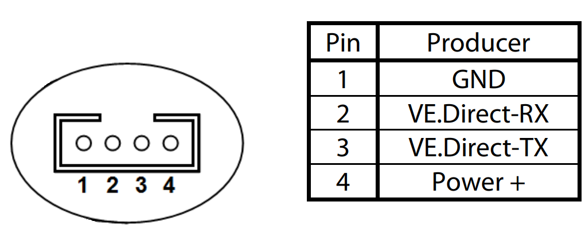

# VE.Direct Interface

## Use Cases

OpenDTU-OnBattery supports reading and interpreting unsolicited status messages
sent by VE.Direct-compatible devices. This currently includes Victron MPPT
charge controllers and Victron SmartShunts. These devices send data in fixed
intervals (1s for MPPT charge controllers with recent firmware) using a 5V or
3.3V serial UART.

Since OpenDTU-OnBattery version 2024.05.03 there is also support to send data
to the VE.Direct device to query additional information.

## VE.Direct Design

### Protocol Variants

Victron VE.Direct devices support two protocols.

#### TEXT-Mode

OpenDTU-OnBattery supports interpretation of TEXT-Mode messages. The VE.Direct
device will periodically transmit data fields using this mode.

To receive TEXT-Mode messages

* an ESP32 pin must be connected to the TX line of the device's VE.Direct port.
* that pin must be configured in the [device
  profile](../firmware/device_profiles.md) as the RX pin (receive data from
  VE.Direct device).

#### HEX-Mode

Since OpenDTU-OnBattery version 2024.05.03 there is support for sending and
interpreting HEX-Mode messages. HEX-Mode allows to read additional data fields
unavailable when listening for TEXT-Mode messages only, e.g., MPPT charger
internal temperature or VE.Smart network total power.

To allow querying HEX-Mode data fields, the TEXT-Mode requirements above must
be met, as well as

* an ESP32 pin must be connected to the RX line of the device's VE.Direct port.
* that pin must be configured in the [device
  profile](../firmware/device_profiles.md) as the TX pin (transmit data to
  VE.Direct device).
* the MPPT firmware must be at least version 1.53 or higher.

!!!note
    Many Victron devices sent unsolicited messages in HEX-Mode alongside
    unsolicited TEXT-Mode messages. Those messages are processed if their type
    is known, or gracefully ignored otherwise.

## Point-to-Point

VE.Direct uses a point-to-point communication scheme. This means each and every
device one wants to communicate with using OpenDTU-OnBattery needs its own
communication channel, both regarding the wiring and the need for a separate
pin and UART on the ESP32.

## VE.Direct Physical Interface

The VE.Direct socket on the Victron device is male and is comprised of four
pins, which are assigned as follows:

!!!warning "VE.Direct VCC"
    The power pin of the Victron device must not be used to drive loads. It can
    only supply around 10mA, according to the
    [FAQ](https://www.victronenergy.com/live/vedirect_protocol:faq).

The ESP32 on your OpenDTU-OnBattery is a data consumer, and the data producer
is the respective Victron device.

Since the Victron device sends data unsolicited, you can optionally leave the
Victron RX pin unconnected. In this case you will not be able to query
additional data fields or use advanced features that require HEX-Mode
communication.

## Cables

The pin header is an off-the-shelf JST PH 2.0 4-pin header, often called "4Pin
MiniMicro JST 2.0 PH". After some research you may be able to source just the
plug. It might be easier to buy an original VE.Direct cable, slice the cable,
and wire its individual wires up to the ESP32.

!!!warning "VE.Direct cable colors"
    Beware that the wire colors in VE.Direct cables may be misleading: Red
    might be GND, black might be VCC, and the other two change their meaning on
    one end of the cable versus the other end, as the cable is a "cross-over"
    cable. Test each wire and confirm to which pin it connects, e.g., using a
    multimeter.

## Wiring Methods

There are multiple options to wire the ESP32 running OpenDTU-OnBattery to a
VE.Direct data producer. The wiring is not straight-forward as many Victron
devices use 5V logic levels, while the ESP32 uses 3.3V logic levels.

### ADUM1201 (safest, most preferred)

The safest and most reliable option is to use a breakout board with an Analog
Devices ADUM1201 chip on it. That chip is a digital isolator, which internally
uses magnetic coupling to transfer information from one voltage domain to the
other.

!!!note "OpenDTU Fusion Add-On"
    The [OpenDTU Fusion](../3rd_party/opendtu_fusion.md#opendtu-onbattery-add-on)
    CAN/Iso shield integrates two of these chips to connect up to two serial devices.

The terminals of your breakout board should be clearly marked and probably
resemble the names in this functional block diagram of the chip:

Connect `VDD1` and `GND1` to the VE.Direct data producer ("left" voltage domain
of the chip). Connect VE.Direct `TX` (an output) to the input of the "left"
voltage domain of the chip, i.e., `VIB`. Optional: Connect VE.Direct `RX` (an
input) to the output of the "left" voltage domain of the chip, i.e., `VOA`.

Connect `VDD2` and `GND2` to the ESP32 3.3V supply ("right" voltage domain of
the chip). Connect the output of the "right" voltage domain to a GPIO of the
ESP32, which will be mapped as the (Victron or Battery) `RX` pin in the [device
profile](../firmware/device_profiles.md). It is okay to choose a pin that only
works as an input. Optionally: Connect the input of the "right" voltage domain
to a GPIO of the ESP32, which will be mapped as the (Victron or Battery) `TX`
pin.

Even if the voltage domains turn out to be the same, this chip will protect the
devices from one another, in case a higher voltage than expected is encountered
on any of the pins.

### Level-Shifter (safe)

Using a MOSFET and its parasitic diode, a
[level-shifter](https://www.digikey.de/en/blog/logic-level-shifting-basics) can
be assembled. This solution is less integrated and the respective boards
usually take up more space, especially if they provide four or more channels.
Also, these level-shifters will only work with the higher voltage domain on the
correct "side" of the circuit. They might fail to work reliably if the voltage
domains are the same.

The wiring setup depends on your particular breakout board. Connect the
VE.Direct `TX` pin through the level-shifter with one of the ESP32 pins.
Remember to wire `GND` as well as the positive supply voltage of the VE.Direct
data producer and the ESP32, both at the respective "side" of the circuit.

### Direct (simplest, least preferred)

* Connect VE.Direct `TX` to an unused ESP32 GPIO pin. This may be an input-only
  pin. Configure it in the pin mapping as (Victron or Battery) `RX`.
* Connect `GND` between the two devices.

This works even if your VE.Direct data producer uses 5V logic levels since the
ESP32 seems to tolerate 5V at its GPIOs. Note that this is not stated in the
datasheet, but it was communicated at some point by Espressif. Use the Internet
search engine of your choice to find respective statements. Be prepared that
newer iterations of the ESP32 may **not** be 5V-tolerant without notice.
