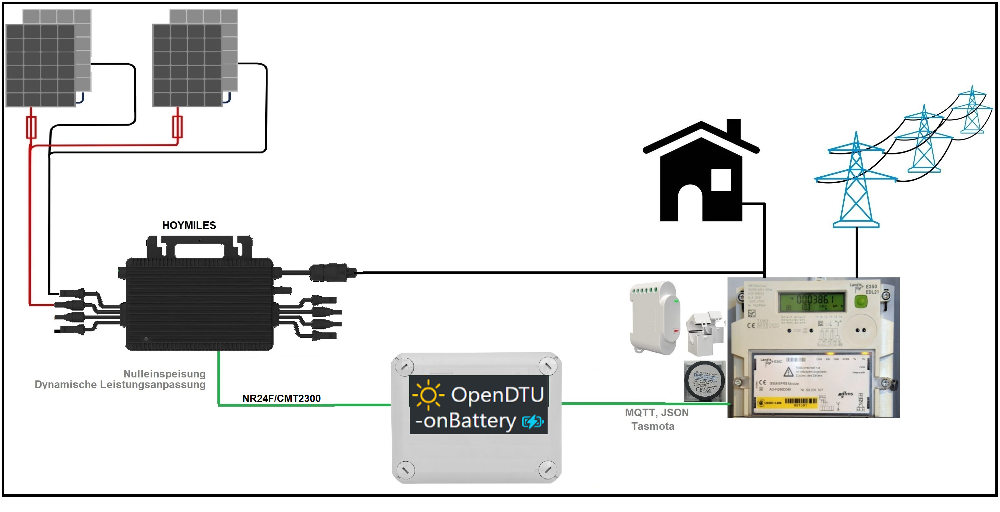
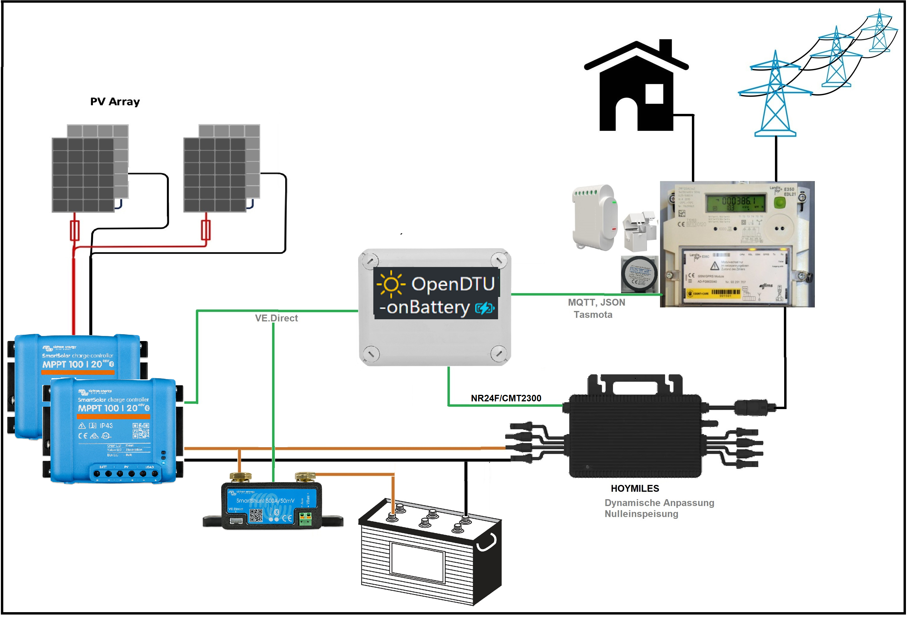

# Home

{align=right}

## OpenDTU-OnBattery

!!! note "Upstream Project"

    OpenDTU-OnBattery is a fork of [OpenDTU][4] by Thomas Basler (tbnobody).

Open Source software to talk to [Hoymiles][1]{target=_blank} solar inverters
and battery peripherals. It is an alternative to Hoymiles Data Transfer Units
(DTUs), which sync data into the s-Miles cloud.

!!! note "Note"

    You can only use one DTU for a specific inverter. You cannot query an
    inverter with two DTUs. Mixing up multiple DTUs may lead to unexpected
    behavior!

## Key Features inherited from the upstream project

* Read live data from inverter
* Show inverters internal event log
* Show inverter information like firmware version, firmware build date, hardware revision and hardware version
* Show and set the current inverter limit
* Show the current grid profile settings
* Function to turn the inverter off and on
* Supports up to 10 inverters
* MQTT support (with TLS)
* Home Assistant MQTT Auto Discovery support
* Nice and fancy WebApp with visualization of current data
* Firmware upgrade using the web UI
* Time zone support
* Ethernet support
* Prometheus API endpoint (/api/prometheus/metrics)
* English, German and French (partially translated) web interface
* Displays (SSD1306, SH1106, PCD8544)
* Status LEDs
* Configuration management (export / import configurations)
* Dark Theme

## Key Features

* Dynamically adjusts one Hoymiles' production to match the currently used energy in the household
* Power Meter interface to read the household power consumption
* Victron VE.Direct interface to communicate with up to two Victron MPPT charge controllers
* Battery interface. Reads the SOC% for starting/stopping the power output and provide the battery data:
     - via CAN bus (SN65HVD230 interface) for Pylontech/Pylontech compatible batteries
     - via Victron SmartShunt (using Ve.Direct protocol)
     - via Jikong (JK) BMS (using serial connection)
     - via MQTT (Broker)
* Battery safety: Reads the voltage from Victron MPPT charge controller or from the Hoymiles DC inputs and starts/stops the power producing based on configurable voltage thresholds
* Battery lifespan efficiency: Reads the actual solar panel power produced by Victron MPPT and adjusts the Hoymiles production accordingly in order to not further charge the battery above a defined SOC%
* Voltage correction that takes the voltage drop because of the current output load into account
* AC charger interface to control a Huawei R4850G2 power supply unit that can act as AC charger. Supports status shown on the web interface and options to set voltage and current limits on the web interface and via MQTT. Connection is done using CAN bus (needs to be separate from Pylontech CAN bus) via MCP2515/TJA1050 interface
* Examples (illustrative)
     * Zero feed-in (in German: Nulleinspeisung)
      

     * With Battery and DC charging via (up to two) Victron MPPT and (optional) Victron SmartShunt. *Note: Due to the limitation of most ESP32 boards, you can only use two Victron units, i.e. two Victron MPPTs or, one Victron MPPT and a Victron SmartShunt. You can not use two Victron MPPTs and a Victron SmartShunt at the same time.*
     

     * With Pylontech Battery and DC charging via (up to two) Victron MPPT
     

     * With Battery and AC charging via Huawei Rectifier (using the Huawei AC charger in combination with the CMT2300A radio board for HMT- HMS- Inverters is not supported at the moment)
     

## Features for developers

* The microcontroller part
    * Build with Arduino PlatformIO Framework for the ESP32
    * Uses a fork of [ESPAsyncWebserver](https://github.com/yubox-node-org/ESPAsyncWebServer) and [espMqttClient](https://github.com/bertmelis/espMqttClient)

* The WebApp part
    * Build with [Vue.js](https://vuejs.org) and [Bootstrap](https://getbootstrap.com)
    * Source is written in TypeScript

## Background

The upstream project was started from [a discussion on mikrocontroller.net](https://www.mikrocontroller.net/topic/525778){target=_blank}.
It's goal was to replace the original Hoymiles DTU (Telemetry Gateway), which uploads data to their cloud. With a lot of reverse engineering, the Hoymiles protocol was decrypted and analyzed.

## Support

For support using OpenDTU-OnBattery you can find us on Github or Discord:

[:material-github: Github Discussions][2]{target=_blank .md-button .md-button--primary }
[:fontawesome-brands-discord: Discord Chat][3]{target=_blank .md-button .md-button--primary }

[1]: https://www.hoymiles.com/
[2]: https://www.github.com/helgeerbe/OpenDTU-OnBattery/discussions
[3]: https://discord.gg/WzhxEY62mB
[4]: https://github.com/tbnobody/OpenDTU
