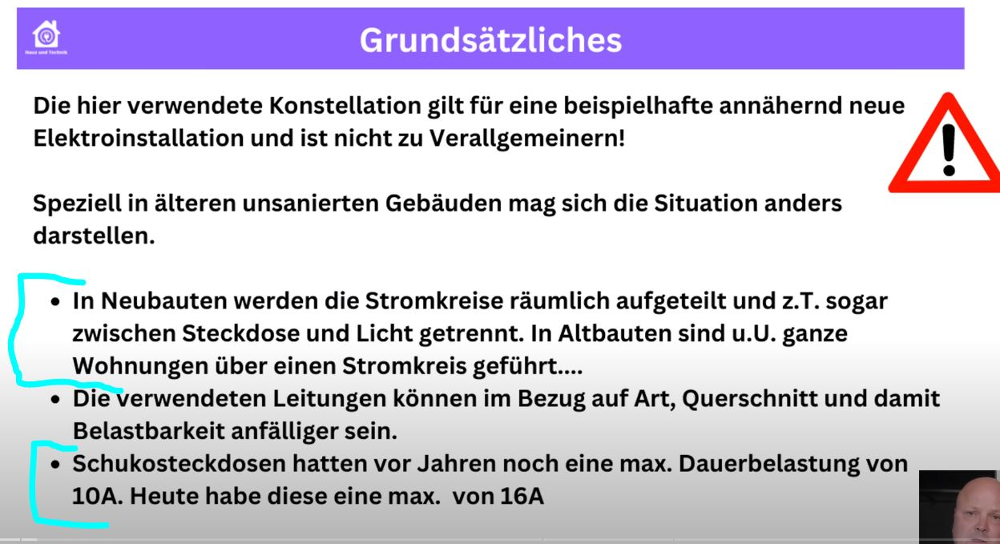

XXL Balkonkraftwerk 1500 Watt und mehr! Worauf Ihr achten solltet!

Unfortunately this video is in German.

General recommendation (from every electrician I know) is to have the Balkokrafwerk connected through a dedicated cable and dedicated safety fuse.
Ideal as it may sound, this is far from being the case in reality!

Many of us prefer "over-dimensioning" our systems, for one simple reason: 

The more panels, the better during the winter months.

This implies that we buy bigger inverters as they are the only ones that allow connecting 4-6 panels.

This brings potential risks during the "sunny months" where sunpower is at max.

The video below explains is a very understandable form, the risks of over-dimensioned systems when things go wrong.

IMPORTANT EXPLANATION: This is a "Doomsday scenario", NOT because of your Balkonkraftwerk.

This video explains what happens in case a problem inside the house happens (in this case, the Dryer which normaly consumes 10A has a short-circuit and consumes 24A) and how the safety fuse CAN NOT recognise the error.

You should just be aware of this.

[XXL Balkonkraftwerk 1500 Watt und mehr! Worauf Ihr achten solltet!](https://www.youtube.com/watch?v=UUG1rPUGpoQ)

